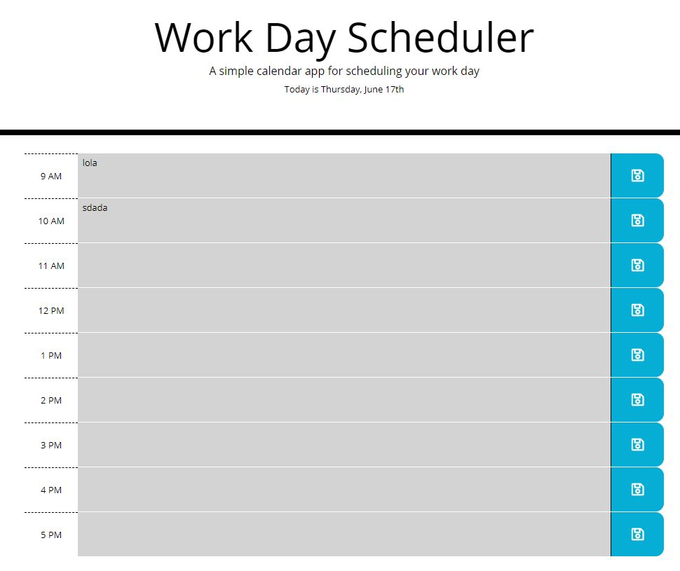

<!-- PROJECT LOGO -->
  <h1 align="center">Third-Party APIs: Work Day Scheduler</h1>

  <p align="center">
    A calendar application that allows a user to save events for each hour of the day. Runs in the browser and features dynamically updated HTML and CSS powered by JQuery.

<!-- TABLE OF CONTENTS -->
<details open="open">
  <summary>Table of Contents</summary>
  <ol>
    <li>
      <a href="#about-the-project">About The Project</a>
      <ul>
        <li><a href="#built-with">Built With</a></li>
      </ul>
    </li>
    <!-- <li> -->
      <a href="#getting-started">Getting Started</a>
      <!-- <ul> -->
        <!-- <li><a href="#prerequisites">Prerequisites</a></li> -->
        <!-- <li><a href="#installation">Installation</a></li> -->
      <!-- </ul> -->
    <!-- </li> -->
    <li><a href="#usage">Usage</a></li>
    <!-- <li><a href="#roadmap">Roadmap</a></li> -->
    <!-- <li><a href="#contributing">Contributing</a></li> -->
    <li><a href="#license">License</a></li>
    <li><a href="#contact">Contact</a></li>
    <!-- <li><a href="#acknowledgements">Acknowledgements</a></li> -->
  </ol>
</details>


<!-- ABOUT THE PROJECT -->
## About The Project



A simple calendar, it tells you the current day, goes from 9 to 5 (because who wants to work extra lol) and a save option
It locally saves the tasks given in case you want to load the page later.

### Built With

* [HTML]
* [JS]
* [CSS]
* [Jquery]
* [Bootstrap]


<!-- GETTING STARTED -->
## Getting Started

Just add your tasks and be productive!!!
It is color coded:
Grey means that hour already passed.
Red means is the present hour.
Green means it is an upcoming event.

<!-- ### Prerequisites -->

<!-- This is an example of how to list things you need to use the software and how to install them.
* npm
  ```sh
  npm install npm@latest -g
  ``` -->

<!-- ### Installation
## Instalation


<!-- USAGE EXAMPLES -->
## Usage

Be productive!!! Go! Do it!

<!-- ROADMAP
## Roadmap


<!-- CONTRIBUTING -->
<!-- ## Contributing


<!-- LICENSE -->
## License

Free to use, share the knowledge!!.


<!-- CONTACT -->
## Contact

Said Hadad - saiddavid.hadad@gmail.com

Project Link: [Repository](https://github.com/SaidHadad/Third-Party-API)

Live Page: [Live PaGE](https://saidhadad.github.io/Third-Party-API/)


<!-- ACKNOWLEDGEMENTS -->
<!-- ## Acknowledgements

<!-- MARKDOWN LINKS & IMAGES -->